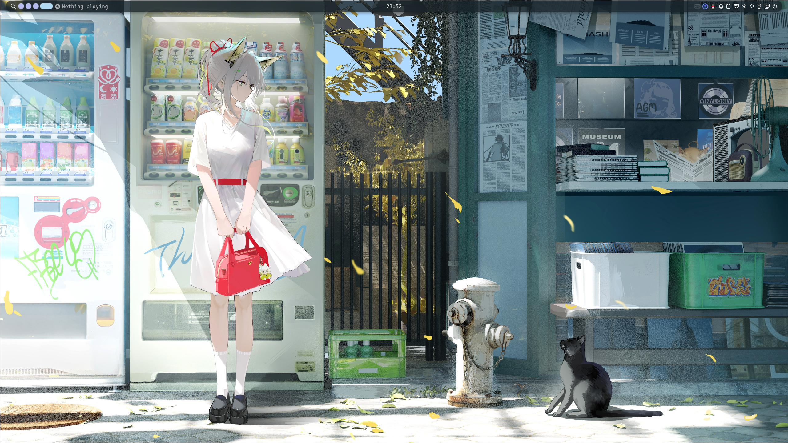
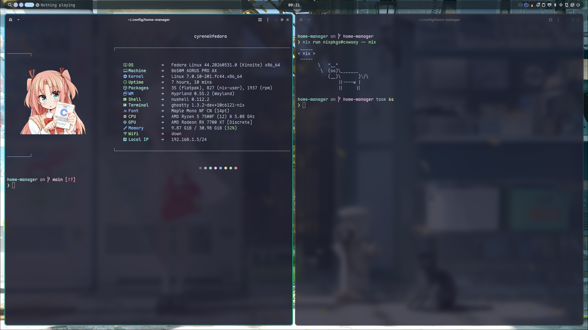

# home-manager

Personal Home Manager and dotfiles repository powered by Nix Flakes. It manages the user environment, desktop theming, development tools, application configs, and reusable project templates.

<p align="center">
  
  
</p>

## Overview

This repository manages the `cyrene` user environment with:

- **Home Manager** for user-level configuration
- **flake-parts** for organizing flake outputs
- `home-manager.flakeModules.home-manager` for reusable `homeModules`
- Application configs collected under `dotfiles/`
- Out-of-store symlinks for editable dotfiles
- A set of language-oriented flake templates

## Repository Layout

```text
.
├── assets/                 # README screenshots
├── devshells/              # perSystem devShells (one file per shell)
├── dotfiles/               # Application configuration files
│   ├── emacs/
│   ├── helix/
│   ├── hypr/
│   ├── niri/
│   ├── nushell/
│   ├── nvim/
│   └── vicinae/
├── flake/                  # flake-parts modules (auto-imported)
├── home/                   # Home Manager modules, each an option
│   ├── packages/           # home.packages, split by category
│   ├── programs/           # programs.* + dotfile symlinks (one file per program)
│   ├── desktop/            # appearance / fonts / stylix
│   └── desktop.nix         # desktop group toggle (parent → children)
├── nixos/                  # Reusable NixOS option modules
│   └── router.nix          #   router (networkd, DHCP, DNS, dae, mihomo)
├── hosts/router/           # Router machine profile (colmena) — the consumer
├── lib/importDir.nix       # recursive *.nix auto-importer
├── templates/              # Flake templates
├── flake.nix
└── flake.lock
```

## Home Manager Modules

The Home Manager configuration lives in `home/`. Every module is
auto-imported by `lib/importDir.nix` (which recursively collects every
`*.nix` file, skipping `default.nix`) and declares its own toggleable option
under the `my.*` namespace, gating its configuration behind `mkIf`.

```text
home/
├── default.nix              # imports = importDir ./. (pure, reusable)
├── core.nix                 # my.core         — username, home dir, nix settings, session vars
├── desktop.nix              # my.desktop      — group toggle + centralised theme knobs (fonts, base16Scheme)
├── packages/                # my.packages.*   — home.packages by category
│   ├── cli.nix  editors.nix  media.nix  ai.nix
│   └── games.nix  lang.nix   extras.nix
├── programs/                # my.programs.*   — one file per program
│   │                          # each owns its programs.* config (if any),
│   │                          # its dotfile symlinks, AND installs its own package
│   ├── firefox.nix  ghostty.nix  kitty.nix  helix.nix  mpv.nix  direnv.nix  nh.nix
│   └── niri.nix  hypr.nix  nvim.nix  nushell.nix  emacs.nix
│       vicinae.nix  go-musicfox.nix  yt-dlp.nix
└── desktop/                 # my.desktop.*    — appearance / fonts / stylix
    └── appearance.nix  fonts.nix  stylix.nix
```

The reusable module (`flake.homeModules.default`) only *declares* the options.
The user configuration (in `flake/home-configurations.nix`) is where each
option is turned on, so toggling a feature is a one-line change there — e.g.
set `my.programs.firefox.enable = false;`.

Each program module owns **both** its `programs.*` configuration (when Home
Manager supports it natively — firefox/helix/ghostty/mpv) and its dotfile
symlinks (via `mkOutOfStoreSymlink`), and installs its own package (so the
package list no longer duplicates entries that a module already manages).
Programs with only raw config files — niri, hypr, nvim, nushell, emacs,
vicinae, go-musicfox, yt-dlp — are symlink modules that also install their
package. There is no separate `dotfiles.nix`; the symlinks live next to the
program they belong to.

### Desktop theme centralisation

`my.desktop` (in `desktop.nix`) is more than a group toggle — it also holds
the centralised theme knobs that the `fonts` and `stylix` sub-modules read:

```nix
my.desktop.fonts.monospace     # "Iosevka Mono Custom"
my.desktop.fonts.serif         # "LXGW WenKai Screen"
my.desktop.base16Scheme        # path to the base16 color scheme
my.desktop.fonts.terminalSize  # 16
```

Changing a font or colour scheme is a single edit in one place; both
`fonts.nix` (fontconfig defaults) and `stylix.nix` (stylix.fonts,
base16Scheme) pick it up. Enabling `stylix` also pulls in `fonts` by default
(via `mkDefault`), because Stylix references font names the fonts module
installs — overridable with `my.desktop.fonts.enable = false;`.

### Module interconnection (NAND pattern)

Some modules form **groups** with a parent toggle. Enabling the parent
auto-enables its children via `mkDefault`, so any child can still be turned
off individually — a NAND-style override:

```nix
my.desktop.enable = true;            # → appearance + fonts + stylix all on
my.desktop.fonts.enable = false;     # …but skip fonts
```

The flake currently exposes:

```nix
homeConfigurations.cyrene     # named after the `username` let-binding
homeModules.default
```

## Usage

### Switch the Home Manager Configuration

Using `nh`:

```bash
nh home switch . -c cyrene
```

Or using Home Manager directly:

```bash
home-manager switch --flake .#cyrene
```

### Enter a Development Shell

Development shells live in a single file, `devshells/default.nix`, as
`perSystem.devShells` entries (imported explicitly by `flake/default.nix`).

```bash
nix develop            # default — Nix tooling (nixd, nixfmt, statix, deadnix, nil)
nix develop .#lint     # formatters and linters only
```

Add a new shell by adding an entry to the `devShells` attrset in
`devshells/default.nix`:

```nix
{ ... }: {
  perSystem = { pkgs, ... }: {
    devShells.my-shell = pkgs.mkShell { ... };
  };
}
```

### Nix Settings

Both the home environment (`my.core`) and the router NixOS configuration
enable the `nix-command`, `flakes`, and `pipe-operators` experimental
features, so the `|>` pipe operator is available everywhere in this repo.

## NixOS Modules

Reusable NixOS configuration lives in `nixos/`. Each module declares options
under `my.hosts.*` and gates its config behind `mkIf`, mirroring the Home
Manager pattern.

```text
nixos/
├── default.nix              # imports = importDir ./.
└── router.nix               # my.hosts.router — single router module
                                 # options: lanInterface, lanAddress,
                                 #          wanInterface, username, sshAuthorizedKey
```

The router machine profile (`hosts/router/default.nix`) is the consumer —
it imports `nixos/` plus the machine's `hardware-configuration.nix`, then
turns on the module:

```nix
{ ... }: {
  imports = [ ./hardware-configuration.nix ../../nixos ];
  my.hosts.router.enable = true;
  # my.hosts.router.username = "someone";  # override defaults as needed
}
```

### Update Flake Inputs

```bash
nix flake update
```

## Dotfiles

Application configs live in `dotfiles/` and are linked into `$XDG_CONFIG_HOME` through Home Manager.

Managed configs include:

- `ghostty`
- `helix`
- `nvim`
- `nushell`
- `hypr`
- `niri`
- `vicinae`
- `emacs`
- `go-musicfox`

Most directories are linked through out-of-store symlinks, making it easy to edit files directly inside this repository and have applications pick up changes immediately.

## Desktop and Theming

The configuration includes a Wayland-oriented desktop setup with:

- Niri / Hyprland configuration
- Ghostty / Kitty terminals
- Bibata cursor theme
- Catppuccin GTK theme
- Papirus icon theme
- Sarasa Gothic SC font
- fcitx5 Chinese input method
- Vicinae launcher

## Templates

The repository ships several flake templates:

```text
templates/
├── cpp
├── md
├── nix
├── rust
└── zig
```

Available templates:

```bash
nix flake init -t .#nix
nix flake init -t .#cpp
nix flake init -t .#rust
nix flake init -t .#md
nix flake init -t .#zig
```

Each template is an independent flake with a language-specific devShell and treefmt setup.

## Useful Commands

Show flake outputs:

```bash
nix flake show
```

Check the flake:

```bash
nix flake check --no-build
```

List Home Manager configurations:

```bash
nix eval --json .#homeConfigurations --apply builtins.attrNames
```

List reusable Home Manager modules:

```bash
nix eval --json .#homeModules --apply builtins.attrNames
```

## Notes

This is a personal environment repository, but nothing is hard-coded to a
specific user. The username is a single `let` binding at the top of
`flake/home-configurations.nix`:

```nix
let
  username = "cyrene";  # change this to deploy for another user
```

This drives both the configuration name (`.#${username}`) and the
`my.core.username` / `homeDirectory` options. The router module similarly
exposes `my.hosts.router.username` (default `"cyrene"`) for its system user.
